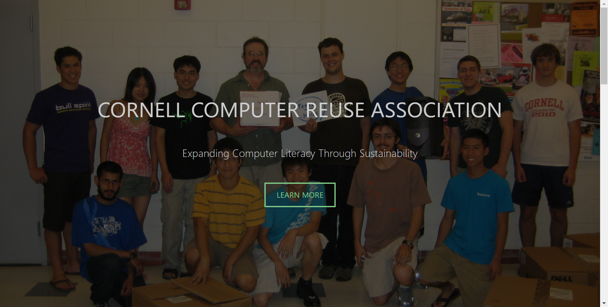
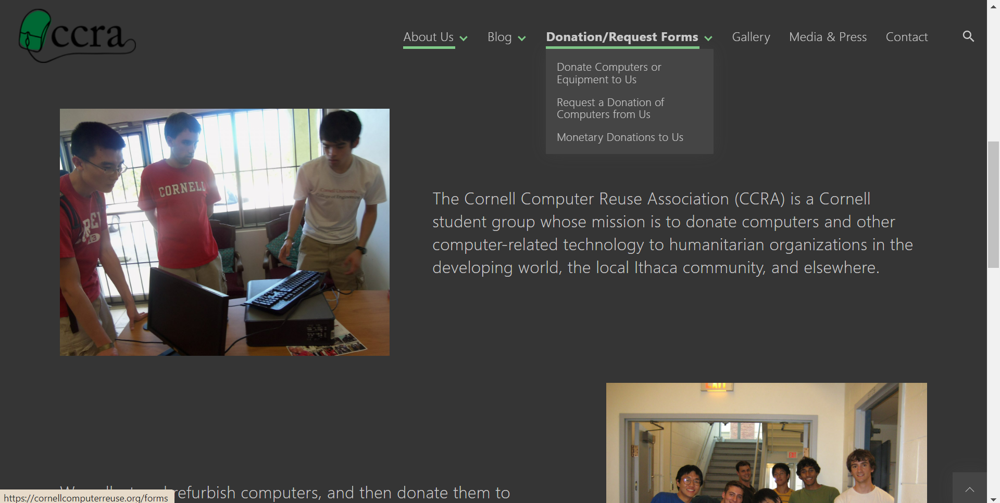
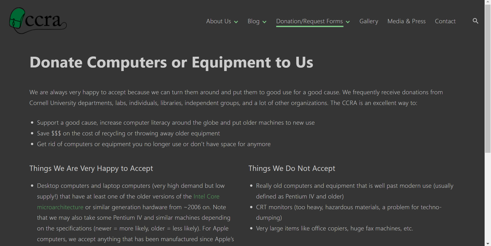
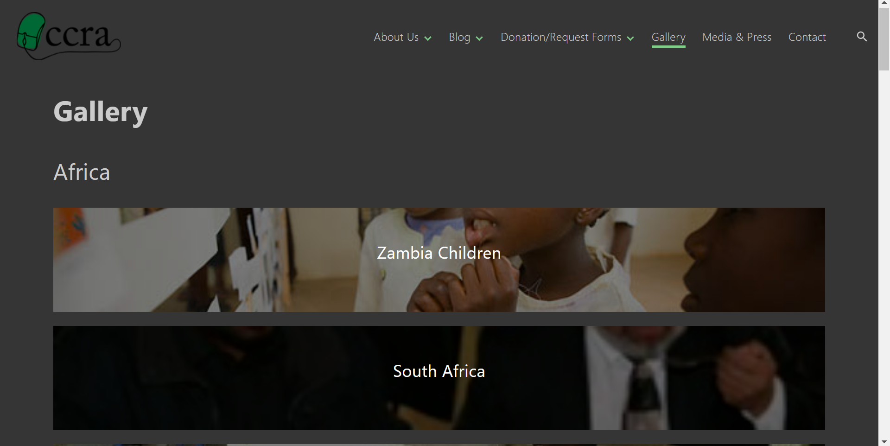
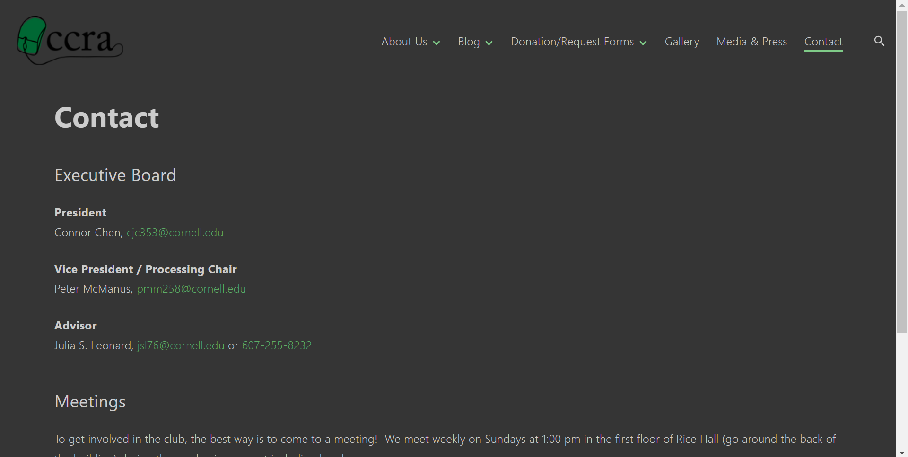

# Group Project: Design Journey

**For each milestone, complete only the sections that are labeled with that milestone.** Refine all sections before the final submission.

You are graded on your design process. If you later need to update your plan, **do not delete the original plan, leave it in place and append your new plan _below_ the original.** Then explain why you are changing your plan. Any time you update your plan, you're documenting your design process!

**Replace ALL _TODOs_ with your work.** (There should be no TODOs in the final submission.)

Be clear and concise in your writing. Bullets points are encouraged.

**Everything, including images, must be visible in _Markdown: Open Preview_.** If it's not visible in the Markdown preview, then we can't grade it. We also can't give you partial credit either. **Please make sure your design journey should is easy to read for the grader;** in Markdown preview the question _and_ answer should have a blank line between them.


## Client (Milestone 1)

### Client Description (Milestone 1)
> Tell us about your client. Who is your client?
> Explain why your client meets the client rules in the project requirements.

Our client is the Cornell Computer Reuse Association (CCRA), which is a registered club on campus.  The point person is Connor Chen, president of the CCRA.

Our client meets the client rules because they need a redesigned static website that meets the specifications in the client information document.  We are not our own client because we are not designing the website for ourselves.  In full disclosure, one of our members, Reid Fleishman, is a member of the CCRA; however, the audience for the site is not Reid nor any of our team members, as stated in the client requirements.

### Client Questionnaire (Milestone 1)
> Develop a client questionnaire to learn more about your client and their goals.
> You may use the questionnaire below, you may modify the questionnaire below, or you may create your own.

1. Describe your organization and its purpose.

    Purpose: spread computer literacy promote sustainability. Repurposing computers for others in need

2. What makes your organization and its services special or unique?

    Theres not another one in the area. It gives good experience to undergrads and grad students and volunteer time

3. Why are you looking for a new website or updating your existing site?

    Current website is outdated and old. Looks outdated. Has a lot of unnecessary stuff.
    We want to gain more traction and make a better impression

4. Who do you want to visit your site? Who do you believe is your website's intended audience?

    Includes students who want to join the club as well as people who want to request or donate computers.

5. When visiting your site, what actions do you want your visitors to take?

    General info for contacting us depending on who you are.

6. What are your goals for this site?

    Look streamlined and clean. Not too much information

7. Is there a "feel" that you want for your site? Are there colors or imagery that you have in mind?

    - Clean
    - Something more bright, white background and green color.
    - Same logo

8. What are your three favorite competitors or similar organizations' websites? Why?

    Definitely wants a modern and clean website. Not as dark but also more inviting for the audience to go on.


### First Client Meeting Minutes/Notes (Milestone 1)
> Include your notes/minutes from your first meeting with your client.

8/25/22 at 8:15 PM - Introduced ourselves and client introduced himself and his organization (CCRA)

8:20 - Described purpose of our project and outlined the features that we can/cannot include for the purposes of our project.

8:25 - Asked client questions from the Client Questionnaire (the bulk of the notes for this section is in the Client Questionnaire section above).

8:30 - Finalized goals of the client and the desired audience and their goals as well.


### Client Website (Milestone 1)
> Tell us about the website that your client wants.
> Tell us the purpose of the website and what it is all about.
> Note: **If you are redesigning an existing website, give us the current URL and some screenshots of the current site.** (FireFox makes it easy to take a full screenshot of a page from the context menu (right click).)
> If you are redesigning an existing site, tell us how you plan to update the site in a significant way that meets the project's requirements.

The website that the client wants is an updated version of their existing website. It will be clean, bright, and have a modern feel to it. The purpose of the website is to allow students to learn about the club (CCRA) and the various projects/events they are involved in as well as to allow people to donate or request computers. The website will give information for students to learn about what work CCRA has done and how to get involved with the club. There will also be information for how to donate or request computers.

 [CCRA Website Home Page](https://cornellcomputerreuse.org/)

 CCRA Header
 
 Home Page
 
 Donation Info Page
 
 Gallery Page
 
 Media and Press Page
 
 Contact Info Page
 


### Client Goals (Milestone 1)
> Identify your client's goals for the website.
> What kind of website do they want? What are their goals for the site?
> There is no required number of goals. You need as many goals as necessary to reflect your client's desires.

1. Attract and provide information to prospective students who may want to become members of CCRA
2. Allow people to donate computers to CCRA
3. Allow people in need to request computer donations

Overall, the CCRA wants a website that is simple and accomplishes the goals of their three audiences, each of which has different goals.


### Client Website Scope (Milestone 1)
> We want your project to be successful! It needs to be ambitious, but not too large.
> A good rule-of-thumb is that you should have about 1 content-full page for each team member.
> Explain why the website you will create for your client isn't too small and isn't too big.
> Explain why you think it's the right size for this project.

The CCRA website falls within the scope of the project because the content that will go on the page is not an overwhelming amount. The CCRA is a student organization which is locally active. As its objective, the website will inform the audience about the basic information about the organization and the donation processes. As our client explained, the goal of the website is for people to explore the club online but have it result with actual engagement in the club events and donations. The content in this website will not exceed more than 6 pages. This will still be ambitious because we are tasks with modernizing and remaking as previous website, but the size of the website is still attainable.


## Plan/Schedule (Milestone 1)
> Make a plan of when you will complete all parts of this assignment.
> This plan is for your team. There is no required format. Format it so that it works for you!
> Your plan should include when you will interview users and analyze their goals.
> Your plan should also include how and when you will assemble/create the sit's content.
> **Tip:** Your team should plan to work ahead. This project really isn't feasible to complete the night before a deadline.

We will divide the work into sprints of a week.

 Here is a general guideline we will adhere to:

 10/30 : 1 interview and 1 example website

 11/6 : Plan, gather, and add all HTML content

 11/13 : Finish all styling and interactivity

 11/16 : Final touches + submit milestone 2

 11/30: Conduct user testing and revise website + final submission


## Understanding Users (Milestone 2)

**Make the case for your decisions using concepts from class, as well as other design principles, theories, examples, and cases from outside of class.**

You can use bullet points and lists, or full paragraphs, or a combo, whichever is appropriate. The writing should be solid draft quality, but it doesn't have to be fancy.


### User Interview Questions (Milestone 2)
> Plan the user interview which you'll use to identify the goals of your site's audience.
> You may use the interview template below and revise it as much as you desire.

**User Interview Briefing & Consent:** "Hi, I am a student at Cornell University. I'm currently taking a class on web design and for a project, I am designing the website for Cornell Computer Reuse Association (CCRA). I'm trying to learn more about the people that might use this site. May I ask you a few questions? It will take about 10 minutes. You are free to quit at any time."

1. Please tell me a bit about yourself. You may omit any personal or private information.

2. Have you ever researched what to do with old hardware? If so, what information were you trying to find?

3. Have you ever donated/given away old technological hardware (computers, displays, printers, etc)?
   - If so, what information did you look for before you donated the hardware?
   - How did you choose where to donate them and what was the process like?

4. Have you ever obtained repurposed hardware before (e.g., an old computer on eBay)?
   - If so, what information did you look for before buying the hardware?
   - What was the process like of receiving the shipment?

5. Think back to the last time you looked for clubs to join.  What information did you want to know about the clubs, and how did you seek it out?

6. What haven't I asked you today that you think would be valuable for me to know?

**After the interview:** "This was really helpful. Thank you so much for agreeing to speak with me today. Have a great day!"


### Interview Notes (Milestone 2)
> Interview at least 1 person for every member of your team from your audience.
> Take notes and include those notes here. Make sure to include a brief description of each interviewee.
> **Copy the interview questions above into each interviewee section below.**
> Take notes for each participant inline with the questions.

**Interviewee 1:**

This participant is a sophomore at University of California, Los Angeles. He is a computer science and math double major from California.

1. Please tell me a bit about yourself. You may omit any personal or private information.
   Hi, I'm currently a sophomore studying computer science and math at UCLA. I like to play video games and cube in my free time.

2. Have you ever in the past researched what to do with old hardware? If so, what information were you trying to find?
   Yes I have. I build my own PCs so I have had to get rid of a lot of old hardware in the past before. I was trying to find if I could get some money in return for my used electronics.

3. Have you ever donated/given away old technological hardware (computers, displays, printers..etc)?
   Yes I have.
   - If so, what information did you look for before you donated the hardware?
    I looked for the closest place I could donate and whether I had to go in person or I could just ship it to them. I also wanted to know if I could get some money in exchange for my electronics.
   - How did you choose where to donate them and what was the process like?
    I saw a trade-in system at Best Buy but they wouldn't offer me any money. My dad works at a university and they have an electronics recycling service so I just gave it to my dad to recycle.

4. Lets say you want to donate an old computer right now. What information would you seek from donation centers?
   I would seek the exact method of donation, whether it be in-person, I can ship it, or if pick up is possible. And then I would try to see if there is a way I can get some money in exchange for my used product.
   - Where would you go and access more information?
    I would probably just go on Google and search up some key words about recycling to find more information.

5. What information do you look for when looking to join clubs on campus?
   Well first I would see if the club actually interests me and if it's a club I would want to invest my time in. The purpose of the club is the most important for me and then I look to see if there are good people there. People that I can really connect with and make meaningful friendships with. Then comes the more logistical things like where they meet and what days/times they meet.

6. What haven't I asked you today that you think would be valuable for me to know?
   Nothing in particular, thank you.


**Interviewee 2:**

I interviewed Pedro, a student at Cornell University. He is majoring in Mathematics and Electro-Computer Engineering.

1. Please tell me a bit about yourself. You may omit any personal or private information.
    I like playing video games and learning and exploring tech.

2. Have you ever researched what to do with old hardware? If so, what information were you trying to find?
    I have. Specially with my old video game consoles, I look up information about the  market value to see if I can sell it or investigate if theres anyway of giving it a "second life". For example, I hacked my old nintendo to add more games so that I could continue playing.

3. Have you ever donated/given away old technological hardware (computers, displays, printers, etc)?
   - If so, what information did you look for before you donated the hardware?
   - How did you choose where to donate them and what was the process like?

    Yes, mostly old game consoles and phones. I usually give them to my younger siblings or cousins. The hardware is sort of passed down through my family.
    Ive always given away my old technological hardware to people near me because it is easier, however I would like to donate to people in need but I don't really know how to do that.

4. Have you ever obtained repurposed hardware before (e.g., an old computer on eBay)?
   - If so, what information did you look for before buying the hardware?
   - What was the process like of receiving the shipment?
    Yes. I got a iphone. My aunt passed it down to me. I searched up basic information about the device and what you could do with it.

5. Think back to the last time you looked for clubs to join.  What information did you want to know about the clubs, and how did you seek it out?
   I usually search for them through campus groups or social media pages. I usually look for what types of events they do and what are their meeting hours. I like to join clubs that are aligned with my likes but also that fit in my schedule.

6. What haven't I asked you today that you think would be valuable for me to know?
   It would be really helpful to know more about the donation process. I also want to learn about where the hardware actually goes.


**Interviewee 3:**

Grace is a sophomore at Cornell studying ECE.

1. Please tell me a bit about yourself. You may omit any personal or private information.

- Grace, sophomore, ECE.

2. Have you ever researched what to do with old hardware? If so, what information were you trying to find?

- Looked up how to throw it out, how to properly dispose of it

3. Have you ever donated/given away old technological hardware (computers, displays, printers, etc)?

- no, usually use it until it's dead so not useful to anyone afterwards

   - If so, what information did you look for before you donated the hardware?
   - How did you choose where to donate them and what was the process like?

4. Have you ever obtained repurposed hardware before (e.g., an old computer on eBay)?

- yes, but not obtained old hardware, instead tried to fix old hardware she already had
- tried fixing for a while but gave up
- fixed by replacing battery, switched out hard drive with ssd
- knew how to fix because brother and neighbor helped and they are both ece majors as well

   - If so, what information did you look for before buying the hardware?
   - What was the process like of receiving the shipment?

5. Think back to the last time you looked for clubs to join.  What information did you want to know about the clubs, and how did you seek it out?

- in general, club fest, obtained information by walking around and seeing
- for clubs she is already interested in, search up on google, look at website, what they do, when they meet

6. What haven't I asked you today that you think would be valuable for me to know?

- nothing

**Interviewee 4:**

 Cameron Goddard is a sophomore at Cornell studying CS in the College of Arts and Sciences.

 1. Please tell me a bit about yourself. You may omit any personal or private information.
    - Cameron is a CS student with minors in Info Sci and ECE, loves old computers, specifically Macs, very interested in computing history.  Interested to learn more about repurposing old computers, thinks it's a good use of them and good thing for the world to give them to other people.
 2. Have you ever researched what to do with old hardware? If so, what information were you trying to find?
     - Yes.  Usually you can return Apple products back to Apple to get some credit, has looked into that but never done that.  He likes to keep his old stuff, but if there’s an easy way to donate it then he would consider donating it.  Says a current problem is that it depends on where you live, wants a central place or location to send it that’s as easy as your nearest Apple Store.  Suggests we publicize this club more so people can donate their personal computers at Cornell.

 3. Have you ever donated/given away/sold old technological hardware (computers, displays, printers, etc)?
    - If so, what information did you look for before you donated/given away/sold the hardware?
      - Yes, old iPhones, thinks they are a lot more durable than computers, donating it is the preferred method.
    - How did you choose where to donate them and what was the process like?
      - Just gives them to his mom and she knows of places in the community; he doesn’t really know himself.

 4. Have you ever obtained repurposed hardware before (e.g., an old computer on eBay)?
    - If so, what information did you look for before buying the hardware?
      - Yes, but he is not buying it for actual use, looks for the novelty and cool factor, not functionality because he is more of a collector.  Said that if he was to buy it for use, he would look for the condition and the limitations of the software.
    - What was the process like of receiving the shipment?
      - Exciting process, but he's always a little skeptical of the computer.  You can see photos on eBay but you don’t rly know what the condition is.  Talked about an experience where a cable he received was bent, and any small thing like that can ruin the experience.

 5. Think back to the last time you looked for clubs to join.  What information did you want to know about the clubs, and how did you seek it out?
     - Clubfest is the biggest thing, not actively looking for clubs unless its around Clubfeet.  But if he hears about one, he wants to know when the club meetings are, the vibe (big/small), how motivated people are, doesn’t wanna join something that’s gonna fade away after a few weeks.

 6. What haven't I asked you today that you think would be valuable for me to know?
    - Nothing

### Goals (Milestone 2)
> Analyze your audience's goals from your notes above.
> List each goal below. There is no specific number of goals required for this, but you need enough to do the job (Hint: It's more than 1 and probably more than 2).

Goal 1: Find out more about the club (when/where they meet)

- Create a contact/join us page where students can contact club e-boards, join the GroupMe, or show up to meetings
- Having the club e-board's contact information allows students to be able to reach out to the club directly and learn more about the club there. Information about meetings (when/where meetings are held) is important for students to get involved. Lastly, adding a link to the GroupMe allows interested students to be able to communicate with club members and get club updates/announcements.

Goal 2: Find out how to make computer/monetary donations and/or request computer donations

- **Design Ideas and Choices** _How will you meet those goals in your design?_
  - Create a group of three pages with each one addressing a specific part of the goals of the audience. Thus, there will be one page to donate computers or equipment, one page to request a donation of computers, and one page to make monetary donations to the club.
- **Rationale & Additional Notes** _Justify your decisions; additional notes._
  - Having a page dedicated to each goal within the larger Goal 2 allows for the audience to easily navigate between different forms of donation, including requesting a donation from the club. This allows for greater management and organization of one of the main goals that need to be addressed in this website.

Goal 3: Learn of the past notable projects the club has been a part of
- **Design Ideas and Choices** _How will you meet those goals in your design?_
  - There is going to be a page that will act as an exhibition of all of the media and press that the club has gathered with their projects. By having this page, the audience will be able to explore past projects and see actual publications of where the donations went and how the project impacted certain communities. This page will also include the link to the actual publication so that people may read more about them.
- **Rationale & Additional Notes** _Justify your decisions; additional notes._
  - This is an important goal for donators, receivers and students wanting to join the club. It provides meaningful information about the projects that a student could be part of if they joined the club. It also provides evidence for people who want to donate but are unsure of how their donation will be used.

Goal 4: Understand how the donations are being used
- **Design Ideas and Choices** _How will you meet those goals in your design?_
  - This goal will be met 2 ways. First we will have a press page in which the audience can look for actual articles written about the clubs past projects. There will also be a page with a gallery of pictures so the audience can see the images of where these donations go to.
- **Rationale & Additional Notes** _Justify your decisions; additional notes._
  - The website needs to give the audience reassurance that their donations will be used for a good cause, it is important that our design and content takes this into consideration. Having the press page will give the audience third party accounts of how the donations are being used, and the images will also show the audience where the donations are going to.


### Audience (Milestone 2)
> Briefly explain your site's audience.
> Be specific and justify why this audience is a **cohesive** group with regard to your website.

Our audience is comprised of prospective donors in the Ithaca community, organizations around the world who want to request computers, and people in the Ithaca community who are interested in joining the club. Although most of the audience comes from Ithaca and others may come from other countries, this audience represents a cohesive group as they all engage in the club's mission.

## Website Design Exploration (Milestone 2)

Identify three websites (preferably static websites) that exist today on the web to draw inspiration from. Please select websites that are similar to the website you wish to create.

Include two screenshots of the home page for each site: narrow and wide.

**We'll refer to these are your "example websites."**

1. <https://www.bruinrecycling.com/>

    

    

2. <https://www.repaircafe.org/en/>

    

    

3. <https://azstrut.org/>

    

    


### Example Website 1 Review (Milestone 2)
> Review the website you identified above. (1 paragraph)
> In your review, include a discussion common design patterns and interactivity in the site.

The Bruin Recycling website is a site where users can find more information about how and where to recycle their electronics. Common design patterns employed by the website include a horizontal navigation bar at the top (for the desktop view). The navigation does not include many options and simply has an option to "recycle" and "drop off" which allows for easy interactivity. There are also large buttons with rounded corners, allowing for a friendlier interface where users are guided to where exactly they can click for more information. The color scheme of the website includes mostly white, blue, and green, which invokes an eco-friendly feeling to the audience. In the mobile version of the site, the hamburger menu is a common design pattern that allows the user to expand the navigation to find exactly where they would like to navigate to on the site.


### Example Website 2 Review (Milestone 2)
> Review the website you identified above. (1 paragraph)
> In your review, include a discussion common design patterns and interactivity in the site.

The Repair Cafe website includes all of the information of the Repair Cafe organization that works on computer literacy and creates hubs all around the world for people to come and repair their devices to reduce the e-waste. The website has a similar topic and content as what will appear in our website. It has information for donors, organizers and visitors and it is a good example of how to create a cohesive website when you have multiple audiences. There are a lot of common design patterns such as a horizontal navigation bar for the wide screen. This website also has a lot of familiar interactivity. The navigation bar in the narrow site is a collapsible side bar that appears when the user clicks it and has an 'x' to leave it. It also includes an FAQ section in which the audience can see the question and click on the question to reveal the answer. This website is a good example for our website because it has very similar content and employs interactivity and common design patterns effectively.


### Example Website 3 Review (Milestone 2)
> Review the website you identified above. (1 paragraph)
> In your review, include a discussion common design patterns and interactivity in the site.

The AZ STRUT (Arizona Students Recycling Used Technology) website is similar to the website we are trying to build as they are both websites for students that serve similar purposes. AZ STRUT refurbishes and donates computers as well as educates students on understanding computers. The content of the website is similar to the content of our website as they give information on how to request computer equipment, how to donate equipment, and how to become a member of the organization. This website also employs common design patterns such as the collapsible navigation bar for narrow screens. For clickable items such as the items in the navigation menu, the "request equipment" button, and the "become a member today" button, common interactivity features are also employed. When the user hovers over these items, they change color so that the user knows it is a clickable item.

## Content Planning (Milestone 2)

Plan your site's content.

### Your Site's Planned Content (Milestone 2)
> List **all** the content you plan to include your website.
> You should list all types of content you planned to include (i.e. text, photos, images, etc.)

**Detailed content is in the ```content.md``` file**
- Mission Statement
- About the club
- Press information
- Club Photos
- E board members contact information
- E board members photos
- How people can Donate hardware
- What can be donated
- What cant be donated
- How to request donation
- How to make monetary donation
- Meeting information

### Content Justification (Milestone 2)
> Explain (about a paragraph) why this content is the right content for your site's audience and how the content addresses their goals.

This content allows the audience to meet their goals. For the audience who want to join the club, this content will inform them about club logistics such as meeting times and places. It also gives them resources to reach out to other club members and leaders through the Group Me and Eboard members' contact information. The audience may also explore past club projects with the media and press content. Pictures of club meetings and notable publications about past projects can give the audience valuable information about how the club is active in the community and the type of projects they contribute to. Additionally, the audience that is looking for information about how to donate hardware can find all the details about what they can or can't donate and the process of donation collection. Likewise, for audiences looking to donate monetary donations, information will also be easily accessible. The audience who has the goal of requesting a donation will also find information on how the process occurs. By having the three elements of donation/request processes on our page, the audience will be provided with all of the information necessary to accomplish their goals.


## Information Architecture (Milestone 2)

### Content Organization (Milestone 2)
> Document your **iterations** of card sorting here. You must have at least 2 iterations of card sorting.
> Include photographic evidence of each iteration of card sorting **and** description of your thought process for each iteration.
> Please physically sort cards; please don't try and do this digitally.


 This first card sort was divided by content that was related to each other. We have each of the different types of donations in different pages. There is also the home page information which is content related to what the club is. Another card "bunch" contains contact information and meeting details. We also decided to have two other pages one for the media and press and a page dedicated to the gallery pictures. This is the general structure that the original site already has so we wanted to experiment seeing how the updated content looked if we were to organize it this way.


For the second card sort, we decided to put all of the donation information in one pile. This would be beneficial so that all of the content that has to do with donations could be found in one specific place. The other content is organized similarly to the first iteration in which there is a main page with club information, a page about meeting and contact details as well as a press page and a gallery page. However, we do think that this content structure makes pages that have disproportionate content. The donation page would be really long and busy while the other pages wouldn't have that problem.


In this iteration we decided to divide the information about donations in separate sections. We divided the donation information is a hardware donation, monetary donation and requesting donation. This way each type of content has its own place. Additionally, we decided to the gallery and the media and press separate because we want to include a lot of pictures so that users can explore all of the club projects.


### Final Content Organization (Milestone 2)
> Which iteration of card sorting will you use for your website?

Card Sort number 3

> Explain how the final organization of content is appropriate for your site's audiences.

This sorting is appropriate for our audience because it carefully divides and structures the content by what the audience might be looking for at a certain point. We thought about the audience goals and decided to structure out content in pages so that each unique goal has a direct page so that the audience can meet this goal successfully. In doing so, we no longer have the issue of pages that are full of information that may make it harder for the user to navigate and read. By organizing the content with the audiences goals in mind, we were able to create a content structure that would allow the audience to find the information that they need quickly. For example, if the audience wants to learn about donating their computer, they will know exactly which page to go to and if they want to join the club, then they will be able to find the Contact/Join Us page that will give them that information. Additionally, we decided that having a separate gallery page would enhance the user experience because people could see all the different types of projects and donations the club has done the past years as well as pictures of the actual club meetings.


### Navigation (Milestone 2)
> Please list the pages you will include in your website's navigation.

- Home
- Press
- Gallery
- Contact Us
- Donation
  - Donate Hardware
  - Donate Money
  - Request Donation

> Explain why the names of these pages make sense for your site's audience.

The names of these pages make sense for our site's audience because it addresses the audience's goals. The Home page will be the landing page where the audience can see general information about what CCRA does and who they are and the press page gives the audience information about publications that the club been featured in. The gallery page will have all the pictures of the different projects so it is useful to name it as a gallery so that the user will know that page will have pictures. The Contact Us/ Join Us name allows the audience to know where to go if they desire to join the CCRA or want to request more information, and then finally "Donation" allows the audience to know where exactly to click if they want to make a donation and/or request a donation. Within the Donation name, there is three subsections, each detailing what specific course of action the audience can take, including donating hardware, donating money, and requesting a donation, which are clear and appropriate names for the site's audience.


## Visual Theme (Milestone 2)
> Discuss several (more than two) ideas about styling your site's theme. Explain why the theme ideas are appropriate for your target audiences. Note the theme you selected for your site and why it's appropriate for the audience and their goals.

Idea 1: Keep the dark hardware theme that the website originally have but make it look really techy and gamer-like. Using a darker background with colors that resemble the hardware that the club works with, it will bring a lot of good contrast with white lettering that will almost appear to look like an old computer. We can also use a font family that is monospace to further add that computer theme. This is appropriate for the audience because it plays with the concept of the club which is technology and computers.

Idea 2: Make a bright website with light background and the club's green color as accent pieces. We would be imitating the style that a tech companies like Apple use of a very clean website with minimal decoration, but making the text pop with the green color that the club likes to use. We would also use a sans-serif font as this is not meant to be a very formal website. By doing this design we can make a design that is really approachable to all of the audience. It will be minimalistic in style but will make the website look cohesive so that its easy for the users to use.

Idea 3: The website will have a light background, either white or light gray, with dark gray/black text to have a minimalist professional design. Texts that we want to pop out such as headings or links will have the club's green color. To look professional and evoke trust for future donators, we will use serif font. This will allow the website to look really professional and formal. This will make it so that the typography is uniform and clean.

We will do the second visual theme. We chose to do this one because we felt it was the most approachable and welcoming one for our audience. We wanted students to be excited about joining the club, but for people that were donating we wanted to make sure it looked professional and serious so that they trust the team with their donations. This theme is the middle ground for both as it play with the current trend of minimalist tech design, but also uses color to bring the more youthful part of the club out.

- Colors: Green, Dark Gray, White
  - rgb: 44,103,57 (hex code: #2c6739)
  - rgb: 53,53,53 (hex code: 353535)
  - white
- Font: Sans-Serif


## Design (Milestone 2)

Document your site's layout.

## Interactivity Brainstorm (Milestone 2)
> Using the audience goals you identified, brainstorm possible options for interactivity to enhance the functionality of the site while also assisting the audience with their goals.
> Briefly explain idea each idea and provide a brief rationale for how the interactivity enhances the site's functionality for the audience.
> Note: You may find it easier to sketch for brainstorming. That's fine too. Do whatever you need to do to explore your ideas.

- Navigation Bar
  - We want to add interactivity by having the navigation bar in the narrow-size version of the website be a hamburger/collapsible menu bar. This interactivity will enhance design because it will take away the need to take up valuable vertical space to have the navigation bar. Additionally, it leverages familiarity as navigation bars are common with narrow-screen websites. This will allow the user to find the page that they are looking for while browsing on a narrow screen without taking up space on the page.
- Gallery (Slideshow)
  - We want to include a media page with a lot of pictures of club meetings. To enhance this design, instead of having many pictures next to each other, we want to add a gallery slideshow of the photos. This way, users can click through the images and explore what club meetings looks like. By adding this, the design will look much cleaner and more concise for the audience and will allow them to learn more about the club by clicking through the pictures.
- Drop Down in Navigation
  - Since 3 of our pages are considered sub-pages, we want to have another drop-down menu for the pages that have to do with donations and requests. Not doing this would make the navigation crowded because we would have 8 pages. Instead, by using interactivity, if a user is interested in the donations, they can click on the donations and the three options appear.


### Layout Exploration (Milestone 2)
> Iterate on your site's design through sketching.
> Sketch both the narrow and wide versions of the site.
> Here you are just exploring your layout ideas. You don't need to sketch every page.
> Include some of your interactivity ideas in your sketches.
> Provide an explanation for each sketch explaining the idea and the design patterns you are leveraging.


The home page includes all the essential information about the club, including text and an image describing what they do.  The narrow version uses a single-column layout to make everything easily viewable on a small screen.  The wide version employs a two column layout to maximize utilization of the space.


For this page, I am using flexbox in order to make a clear distinction between two columns, namely "Things We Are Very Happy to Accept" and "Things We Do Not Accept." This creates a clear separation and distinction between these two sections of the webpage, allowing users to easily see the difference between the two in a list format.


For this page, the content is listed as a list, allowing the users to easily parse through the items of the list and understand the terms and conditions of requesting a donation and how exactly to do that.


For this page, the steps to make a monetary donation is listed as an enumerated list, allowing the users to know how exactly to make a monetary donation and in what specific order.


This sketch shows the club's meeting information at the top of the page and follows with the executive board members' photos and contact information. It is important for the meeting information to be at the top of the page so that users do not have to scroll all the way to the end of the page just to find meeting information. In the narrow version, the executive board members are not layed out in rows but rather in a column due to the size of the screen.


This sketch shows the titles and links to the club's press coverages. It lays these out in rows so that there is little blank space on the wide version of the page. On the narrow version of the page, the titles and links are layed out one after the other in a column.


For the gallery page, we drew various sketches of how the images could be displayed. The first sketch for both the wide and narrow version of the page have the images in a table. This would allow users to look at all the different pictures. Additionally, it would have some interactivity because the user could click on one picture and it would become larger (somewhat like a modal). For the second sketch idea, we wanted to leverage the use of slideshows to make the photos stand out more on the page. We decided to add a gallery slide show. This also allows us to separate the pictures of different events so that the user can change slide shows when they want to see the pictures of other outreach projects.


### Final Design (Milestone 2)
> Include the final sketches for each of your pages.
> **Include your final interactivity in your sketches.** Include annotations to explain what happens when the user takes an action with your interactivity.
> The sketches must include enough detail that another 1300 student could implement them.
> However, you don't need to provide layout/CSS annotations.
> Please, provide an explanation for each sketch.

**Narrow (Mobile) Design:**

The narrow version of the home page will have the narrow nav bar, as usual, plus all the content in a single-column view.


For this page, I am using flexbox in order to make a clear distinction between two columns, namely "Things We Are Very Happy to Accept" and "Things We Do Not Accept." This creates a clear separation and distinction between these two sections of the webpage, allowing users to easily see the difference between the two in a list format. The only interactivity on this page is the hamburger menu icon that displays the navigation bar elements when clicked.


For this page, the content is listed as a list, allowing the users to easily parse through the items of the list and understand the terms and conditions of requesting a donation and how exactly to do that. The only interactivity on this page is the hamburger menu icon that displays the navigation bar elements when clicked.


For this page, the steps to make a monetary donation is listed as an enumerated list, allowing the users to know how exactly to make a monetary donation and in what specific order. The only interactivity on this page is the hamburger menu icon that displays the navigation bar elements when clicked.


The narrow version of the gallery page will feature a gallery carousel that will be interactive. The user will be able to use the next and previous arrows to look through the photos. Under the slideshow will be the different galleries. Once the user clicks on these, the slideshow will change to be the images of that event.


The narrow version of the press page will feature a hamburger menu for interactive navigation. It will list out mentions in the press as shown, in boxes that will be clickable so that when a user clicks on the box, they will be brought to the linked page. They will also be able to click the link to navigate to the linked page.


The narrow design of the contact page will show club meeting information at the top of the page followed by executive board member photos, names, and contact information. The images will be in circular frames to emulate that of a LinkedIn profile picture. This design will also feature a hamburger menu for interactive navigation.

**Wide (Wide) Design:**

The wide version of the home page will have the wide nav bar, as usual, plus all the content in a dual-column view.  The images are alternating to make the layout more balanced.


For this page, I am using flexbox in order to make a clear distinction between two columns, namely "Things We Are Very Happy to Accept" and "Things We Do Not Accept." This creates a clear separation and distinction between these two sections of the webpage, allowing users to easily see the difference between the two in a list format. There is no interactivity on this page.


For this page, the content is listed as a list, allowing the users to easily parse through the items of the list and understand the terms and conditions of requesting a donation and how exactly to do that. There is no interactivity on this page.


For this page, the steps to make a monetary donation is listed as an enumerated list, allowing the users to know how exactly to make a monetary donation and in what specific order. There is no interactivity on this page.


The gallery page will use a lot of interactivity to enhace the user experience. We will use gallery carousel so that the user can interact with the page and look through the picture. Additionally, the user can switch between different albums of photos by clicking the buttons of the different events.


The wide version of the press page will also list out mentions in the press but will lay them out in rows. Like the mobile design, each box will be a button so that when a user clicks on the box, they will be brought to the linked page. They will also be able to click the link to navigate to the linked page.


The wide design of the contact page will show club meeting information at the top of the page followed by executive board member photos, names, and contact information. Similar to the mobile design, the images will be in circular frames to emulate that of a LinkedIn profile picture but instead, they will be layed out two in one row to minimize empty, unused space on the screen and for easier readability.

### Design Rationale (Milestone 2)
> Explain why your design is appropriate for your audience.
> Specifically, why does your content organization, navigation, and site design/layout meet the goals of your users?
> How did you employ **design patterns** to improve the familiarity of the site for your audience?

This design is appropriate for our audience because the main content that the audience will need for this site is listed in the navigation bar as distinct sections of the website. For example, audience members that desire to donate or request computers can easily navigate to the "Donate/Request Computers" section, while audience members that are curious about what the club does and how they can join can navigate to the "Contact Us" section. The design and layout of the site are also made to feel familiar to users, with a traditional navigation bar at the top for the desktop view and a hamburger menu for the mobile view. Some design patterns that we employed to improve the familiarity of the site for our audience were carousels with feedback indicators at the bottom to indicate which photo of the album the user is viewing at the current moment, with common affordances such as arrow pointers so that the user knows how to navigate to the next photo in the carousel. In the "Donate/Request Computers" section of the navigation bar, there is also an arrow that affords to click and a dropdown menu is displayed to show the subsections within the main section which the user can navigate to as well. For buttons within the website, hover effects allow the user to know which button they are about to click as well.


## Interactivity Rationale (Milestone 2)
> Describe the purpose of your proposed interactivity.
> Provide a brief rationale explaining how your proposed interactivity addresses the goals of your site's audience and enhances their user experience.

The main interactive element on the website is the navigation bar, including both the dropdown menu and the hamburger menu.  The dropdown menu will help the user access information more quickly, achieving their goals.  For instance, if the user wants to request a donation of computers, they simply click the "donate/request computers" tab, which will expand to reveal the tab they need.  If all of the tabs were on a single line, there would be seven tabs, which is considered a lot (and could overwhelm the user).  The hamburger menu helps increase the amount of space for content on the narrow version by essentially removing the navigation bar.  By leaving more space for content, users won't have to spend time scrolling, helping them achieve their goals.

One of the interactive elements on our website will be a gallery carousel. The club has a lot of really amazing pictures of the past projects they have done and we wanted to highlight some of these projects. However, we didn't want to just create a page with a lot of images and no organization. Instead, by having the carousel, the audience can learn more about what the club has done in the past. These pictures are important for the audience's goals because they are warrants to show the actual projects that the club does and where the donations go, by having the pictures be displayed with this carousel interactivity, the audience will be able to meet these goals.


## Interactivity Plan (Milestone 2)
> Now that you've designed your interactivity for your site, you need to plan how you will implement it.
> Describe how you will implement the interactivity. This should be a complete plan that another 1300 student could use to implement the interactivity.
> You should list the HTML elements, CSS classes, events, pseudocode, and the initial state.

**Nav Bar Interactivity:**
To make the nav bar interactive, we will add a dropdown menu (wide view) and a hamburger menu with a dropdown menu (narrow view).  The dropdown menu will be triggered using a button, and the menu will appear on top of the other elements.  The hamburger menu will also be triggered using a button, and will make space within the header.  When pressing the dropdown menu button with the hamburger menu open, additional space will be created.  Additionally, when closing a hamburger menu with the dropdown open, the hamburger menu AND the dropdown will be closed.


Note: While developing the interactivity, I decided to change the #hamburger-dropdown div to instead a #nav_list id on the parent ul element.

For Dropdown Menu:
```
when #donate-li is clicked:
    if #dropdown has the .hidden class:
        remove .hidden from #dropdown
        add .arrow_rotated to #nav_arrow
    else:
        add .hidden to #dropdown
        remove .arrow_rotated from #nav_arrow
```

For Hamburger Menu:
```
when #hamburger is clicked:
    if #nav_list has the .hidden class:
        remove .hidden from #nav_list
    else if #dropdown has the .hidden class
        add .hidden to #dropdown
        add .hidden to #nav_list
        remove .arrow_rotated from #nav_arrow
    else:
        add .hidden to #nav_list
```

**Gallery Interactivity:**
To create the gallery interactive we will essentially create 5 working galleries for each of the photo albums. In each gallery component there will be the photos, a left and right arrow and the dots at the bottom. With the arrows the user will be able to click to the next picture and the previous picture. For the dots, they will work as both indicators of which picture you are on, and work as buttons to move to a specific picture.
The initial state has the first picture in the gallery visible and all others hidden, with the arrows side by side and all of the dots visible and consistent with the number of images in the carousel


```
It will be the same for all carousels the k will just change to the respective identifier
when #nextk is clicked
  go to next slide
when #lastk is clicked
  go to previous slide

when #dot1k is clicked
  go to slide 1

when #dot2k is clicked
  go to slide 2

when #dot3k is clicked
  go to slide 3

when #dot4k is clicked
  go to slide 4

when #dot5k is clicked
  go to slide 5
```

COMMENT AFTER IMPLEMENTING: In order for each of the carousels to fully work, we had to change the name of the functions and essentially create a new function for each of the carousels. The java script has various comments on the separation of interactivity components to make it easier to understand.

In addition to the gallery slideshow component, there is also the buttons that switch between gallery. When a user clicks on an album button, the gallery will change to be the photos of that album.

The initial state will have the club pictures be visible


```
when #club is clicked:
  remove .accessible-hidden from #clubcarousel
  add .accessible-hidden to #kenyacarousel
  add .accessible-hidden to #afriquecarousel
  add .accessible-hidden to #nicaraguacarousel
  add .accessible-hidden to #perucarousel

when #kenya is clicked:
  remove .accessible-hidden from #kenyacarousel
  add .accessible-hidden to #clubcarousel
  add .accessible-hidden to #afriquecarousel
  add .accessible-hidden to #nicaraguacarousel
  add .accessible-hidden to #perucarousel

when #afrique is clicked:
  remove .accessible-hidden from #afriquecarousel
  add .accessible-hidden to #kenyacarousel
  add .accessible-hidden to #clubcarousel
  add .accessible-hidden to #nicaraguacarousel
  add .accessible-hidden to #perucarousel

when #nicaragua is clicked:
  remove .accessible-hidden from #nicaraguacarousel
  add .accessible-hidden to #kenyacarousel
  add .accessible-hidden to #afriquecarousel
  add .accessible-hidden to #clubguacarousel
  add .accessible-hidden to #perucarousel

when #peru is clicked:
  remove .accessible-hidden from #perucarousel
  add .accessible-hidden to #kenyacarousel
  add .accessible-hidden to #afriquecarousel
  add .accessible-hidden to #nicaraguacarousel
  add .accessible-hidden to #clubcarousel

```

## Client Feedback & Minutes (Milestone 2)
> You should meet with your client again to obtain feedback on your design.
> Provide a summary of the client's feedback and your meeting's minutes.

### Client Feedback
**Color Scheme**
- Likes the green and the white. Fix the blue highlighted links. Make them black. also make the line under the links a little more spaced down. Make a uniform white for the entire website.

**Home Page**
- round image corners
- less use of bold everywhere (captions and text you don't need bold)
- color of dropdown make it the same as the other green

**Donation page**
- decrease spacing between the two sections

**Monetary donation page**
- pictures of the process rather than just a bulleted list
- spacing between top middle and bottom could be lessened

**Gallery**
- make all the tabs rounded
- make all the images rounded
- maybe the images don't even need a border

**Media and press**
- take away blue text and underline on the links
- round all borders
- links could have some hover effects

**Contact Us**
- make images closer to the names
- crop the advisor picture to make it square
- put image on top of the name
- make images a circle
- put GroupMe QR code on the contact us page

**Mobile View**
- make hamburger menu less thick
- remove logo on nav bar
- hamburger menu could maybe be gray instead of black
- dropdown should be centered
- gallery:
  - put some margin between navbar and image
  - make tabs a dropdown (if wanted)

### Meeting Minutes
4:20 - Requested feedback for desktop website. Walked Connor through our entire desktop website and requested feedback for each page.
4:35 - Requested feedback for mobile website. Walked Connor through our entire mobile website and requested feedback for each page.
4:40 - Requested any overall feedback and last minute feedback.


## User Testing (Final Submission)

**Conduct user testing with a minimum of 1 participant for every member of your team.**

### User Testing Tasks (Final Submission)
> Plan out your user testing tasks before doing your user testing.
> These must be actual user testing tasks.
> **Tasks are not questions!**

1. Walk me through how you would donate $25 to the club

2. You are interested in donating computers, but you want to see past examples of our work before you donate.  Find two locations that the club has donated computers to.

3. You want to donate a 2014 MacBook Pro, a CRT monitor, a keyboard/mouse, and a large copier.  Identify which of these items you are allowed to donate.  Afterward, identify how you would go about donating them.

4. You want to ask the club advisor some questions before you request computers.  Find their email address.

5. You decide to request computers, but you need 100 computers with free shipping.  Determine whether the CCRA would be able to accommodate your request.

6. You still doubt the CCRA's credibility, and want to find some news articles describing our past work.  Find a compelling article.

7. You are a student who is interested in joining the club.  Determine when/where the club meets and how to communicate with its members.


### Participant 1 (Final Submission)
> Using your notes from above, describe your user by answering the questions below.

1. Who is your user, e.g., where does the user come from, what is the user's job, characteristics, etc.?

    This participant is named Andrew. Andrew is a junior at Cornell University studying Electrical and Computer Engineering. He is interested in robotics. Andrew works at the TechConnect in the Cornell Store.


2. Does the user belong to your audience of the site?

    > If “No”, what’s your strategy of associating the user test results to your audience’s needs and wants? How can your re-design choices based on the user tests make a better fit for the audience?

    Yes, this user is part of the audience. Specifically, he is someone that would be interested in joining the club given that his hobbies include working with machinery. Additionally, his job on campus is relevant to the website as the Cornell Store Computer section may potentially handle donations or be interested participating in a club event.


### Participant 1 -- Testing Notes (Final Submission)
> When conducting user testing, you should take notes during the test.

1. Walk me through how you would donate $25 to the club
   - User immediately went to the donation page and subsequently chose the Give Money tab.

2. You are interested in donating computers, but you want to see past examples of our work before you donate.  Find two locations that the club has donated computers to.

   - The user did go to the Gallery page but was unsure where to identify the locations in which the computers were donated. They did not look at the press page for other information of possible projects.


3. You want to donate a 2014 MacBook Pro, a CRT monitor, a keyboard/mouse, and a large copier.  Identify which of these items you are allowed to donate.  Afterward, identify how you would go about donating them.
   - User was able to identify adequately where to find what donations are allowed. He did ask what constitutes as a large copier.

4. You want to ask the club advisor some questions before you request computers.  Find their email address.
   - Andrew went directly to the contact page and identified the advisors email.

5. You decide to request computers, but you need 100 computers with free shipping.  Determine whether the CCRA would be able to accommodate your request.
   - User was able to identify that the CCRA could not accommodate request. They went directly to the request computer page.

6. You still doubt the CCRA's credibility, and want to find some news articles describing our past work.  Find a compelling article.
   - The user did find the press page and identified a source, but did not think of clicking on the box-- maybe it doesn't look like a clickable button?

7. You are a student who is interested in joining the club.  Determine when/where the club meets and how to communicate with its members.
   - The user went directly to the contact us page and identified the information fast


### Participant 2 (Final Submission)
> Using your notes from above, describe your user by answering the questions below.

1. Who is your user, e.g., where does the user come from, what is the user's job, characteristics, etc.?

    The user is Vicky, a sophomore at Cornell studying electrical and computer engineering. She is originally from Virginia.


2. Does the user belong to your audience of the site?

    > If “No”, what’s your strategy of associating the user test results to your audience’s needs and wants? How can your re-design choices based on the user tests make a better fit for the audience?

    Yes, Vicky is someone who would potentially be interested in joining the club as it aligns with her studies in electrical and computer engineering.


### Participant 2 -- Testing Notes (Final Submission)
> When conducting user testing, you should take notes during the test.

1. Walk me through how you would donate $25 to the club

- navigated to donate/request computers on the nav bar
- navigated to give money, clicked the link, and followed the instructions listed on the page about how to donate money
- however, had trouble finding the "special instructions" field

2. You are interested in donating computers, but you want to see past examples of our work before you donate.  Find two locations that the club has donated computers to.

- navigated to the donate computers page
- read through page but couldn't find anything
- navigated to the home page
- initially identified the two locations as "humanitarian organizations" and "the local ithaca community"
- then navigated to the gallery and identified "kenya computer lab" and "codeAfrique"

3. You want to donate a 2014 MacBook Pro, a CRT monitor, a keyboard/mouse, and a large copier.  Identify which of these items you are allowed to donate.  Afterward, identify how you would go about donating them.

- navigated to the donate computers page
- correctly identified whether or not each item would be accepted
- correctly identified how you would donate the items (by emailing the president)

4. You want to ask the club advisor some questions before you request computers.  Find their email address.

- navigated to contact us page, scrolled down to find advisor's email

5. You decide to request computers, but you need 100 computers with free shipping.  Determine whether the CCRA would be able to accommodate your request.

- navigated to the request computers page, answered no, the request cannot be completed
- based on the cap on the first donation of 20 computers (was confused about if this also applied to other donations)
- and based on the listed information saying we don't cover shipping costs


6. You still doubt the CCRA's credibility, and want to find some news articles describing our past work.  Find a compelling article.

- found article by cornell daily sun by navigating to the press page

7. You are a student who is interested in joining the club.  Determine when/where the club meets and how to communicate with its members.

- navigated to the contact us page
- identified meeting time and place under meetings
- identified link and qr code to join the group me


### Participant 3 (Final Submission)
> Using your notes from above, describe your user by answering the questions below.

1. Who is your user, e.g., where does the user come from, what is the user's job, characteristics, etc.?

   The user is a sophomore student studying computer science at Cornell University. The user comes from New York City and is interested in hardware components, and was enthusiastic when sharing that he had built his own PC.


2. Does the user belong to your audience of the site?

    > If “No”, what’s your strategy of associating the user test results to your audience’s needs and wants? How can your re-design choices based on the user tests make a better fit for the audience?

    Yes, the user belongs to our audience of the site. The user is interested in hardware components in technology and thus may be interested in either joining the club or donating his old parts.


### Participant 3 -- Testing Notes (Final Submission)
> When conducting user testing, you should take notes during the test.

1. Walk me through how you would donate $25 to the club
   - The user immediately clicked on "Donate/Request Computers" in the navigation bar. Then the user clicked on the "Give Money" subsection and correctly navigated to the section detailing how to make a monetary donation to the club.

2. You are interested in donating computers, but you want to see past examples of our work before you donate.  Find two locations that the club has donated computers to.
   - The user first clicked on the "Press" section of the navigation bar and parsed through the different squares of press information. After a couple of seconds, the user clicked on the "Gallery" section of the navigation bar and was able to correctly identify two locations that the club has donated computers to before.

3. You want to donate a 2014 MacBook Pro, a CRT monitor, a keyboard/mouse, and a large copier.  Identify which of these items you are allowed to donate.  Afterward, identify how you would go about donating them.
   - The user immediately clicked on "Donate/Request Computers" in the navigation bar. Then the user clicked on the "Donate Computers" subsection and correctly navigated to the section detailing how to donate computers or equipment to the club. The user parsed through the page and was able to identity which of the items were allowed to be donated. For the second task, the user scrolled around the page and went to the "Contact Us" page before going back to the "Donate Computers" page and deciding that through email was how to donate items.

4. You want to ask the club advisor some questions before you request computers.  Find their email address.
   - The user immediately clicked on "Contact Us" in the navigation bar. The user then scrolled down before correctly identifying the club advisor's email address.

5. You decide to request computers, but you need 100 computers with free shipping.  Determine whether the CCRA would be able to accommodate your request.
   - The user immediately clicked on "Donate/Request Computers" in the navigation bar. Then the user clicked on the "Request Computers" subsection and correctly navigated to the section detailing how to request a donation from the club. After reading through the page, the user correctly identified information about this request under the subsection "Some other things to know."

6. You still doubt the CCRA's credibility, and want to find some news articles describing our past work.  Find a compelling article.
   - The user immediately clicked on "Press" in the navigation bar and correctly navigated to the page with news articles detailing past work of the club. After parsing through the page for a couple of seconds, the user identified an article that they found particularly compelling.

7. You are a student who is interested in joining the club.  Determine when/where the club meets and how to communicate with its members.
   - The user first clicked on "Home" in the navigation bar before realizing the appropriate information for this task was not on the Home page. The user then clicked on "Contact Us" and was able to identify more specific information about the club and its meeting times.


### Participant 4 (Final Submission)
> Using your notes from above, describe your user by answering the questions below.

1. Who is your user, e.g., where does the user come from, what is the user's job, characteristics, etc.?

    My participant is Chris Bauer.  He is a sophomore at Cornell in Mechanical Engineering who is part of a project team called Nexus.


2. Does the user belong to your audience of the site?

    > If “No”, what’s your strategy of associating the user test results to your audience’s needs and wants? How can your re-design choices based on the user tests make a better fit for the audience?

    Yes, as he is a Cornell student.


### Participant 4 -- Testing Notes (Final Submission)
> When conducting user testing, you should take notes during the test.

1. Walk me through how you would donate $25 to the club

- Goes to donate dropdown, goes to give money tab, then reads the directions and clicks on the link, forgot what’s he’s supposed to do so goes back to the website, then follows the directions and types in the amount and the name in the correct spots.  Does this fairly easily, besides jumping back and forth from the website to the giving link.

2. You are interested in donating computers, but you want to see past examples of our work before you donate.  Find two locations that the club has donated computers to.

- Goes to gallery tab with uncertainty, sees Kenya computer lab and Nicaragua computer lab.

3. You want to donate a 2014 MacBook Pro, a CRT monitor, a keyboard/mouse, and a large copier.  Identify which of these items you are allowed to donate.  Afterward, identify how you would go about donating them.

- Goes to donate tab and identifies that keyboard/mouse and Mac is allowed, and easily determines that CRT and the large copier are not accepted.

4. You want to ask the club advisor some questions before you request computers.  Find their email address.

- Goes to contact us page, scrolls down and finds the advisor email address easily.

5. You decide to request computers, but you need 100 computers with free shipping.  Determine whether the CCRA would be able to accommodate your request.

- Goes to request computers page, reads a bit and says it's not allowed because the cap for the first donation is 20 computers, and identifies that free shipping is also not allowed.

6. You still doubt the CCRA's credibility, and want to find some news articles describing our past work.  Find a compelling article.

- Goes to press tab and easily picks a random article.

7. You are a student who is interested in joining the club.  Determine when/where the club meets and how to communicate with its members.

- Goes to home tab, scrolls down, clicks contact/join us button, finds that meetings are weekly on Sundays at 1 pm in Rice Hall and sees a Groupme.


## Website Revision Based on User Testing (Final Submission)
> What changes did you make to your design based on user testing?

One of the revisions we did was to add captions to the images in the gallery. While the names of the gallery albums told the user what the pictures were of, we wanted to make sure we included information about what project the CCRA completed in those pictures. Additionally, we made the gallery images a bit smaller so that the dots feature at the bottom was more visible to the user as they clicked through the gallery.

Another revision was to add buttons on the bottom of the home page, specifically a contact/join us button, because we found that people did not know where to go to join the club.  We implemented these changes before the final user interview, and we found success, as that person utilized that button.

## Grading (Final Submission)

### Collaborators (Final Submission)
> List any persons you collaborated with on this project.

We have no collaborators except each other and Connor Chen, our client.


### Reference Resources (Final Submission)
> Please cite any external resources you referenced in the creation of your project.
> (i.e. W3Schools, StackOverflow, Mozilla, etc.)

This StackOverflow article was referenced to make buttons link to a page on the website: https://stackoverflow.com/questions/6393827/can-i-nest-a-button-element-inside-an-a-using-html5?noredirect=1&lq=1

This W3Schools article was referenced to redirect to a linked press article: https://www.w3schools.com/howto/howto_js_redirect_webpage.asp
